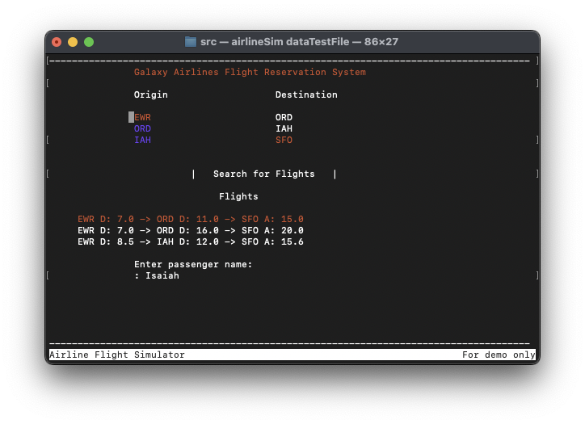
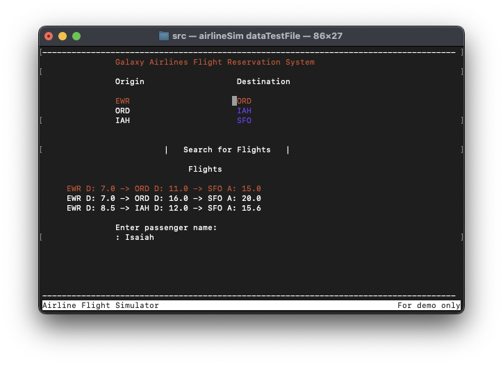
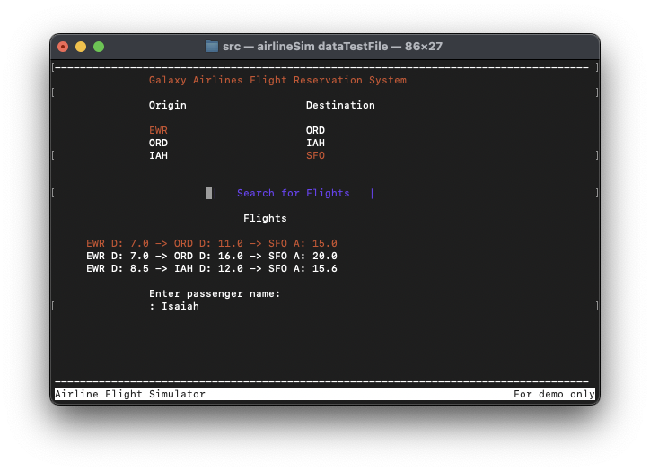
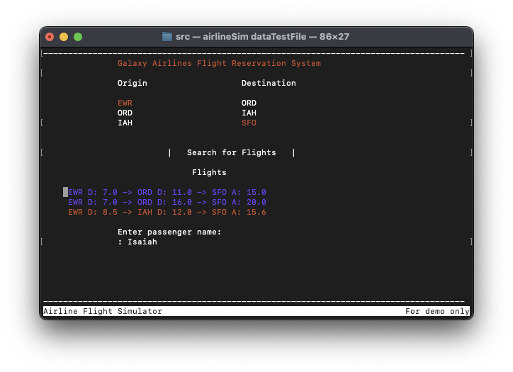
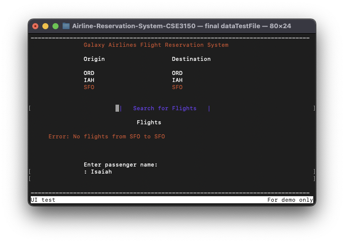

# Flight-Itinerary-Generator-C++Essentials
### Starter code provided by a UConn professor Spring 2024

## Description

This project is designed to generate a number of itineraries from one location to another.  An example itinerary is shown below:
    `EWR D: 7.0 -> ORD D: 11.0 -> SFO A: 15.0`
In the above itinerary, each of the three letters is an airport code and the numbers are the time of arrival (A) or depature (D) from that specific airport. Origin airports can be selected from the Origin section on the left and the destinations can be selected from the airports on the right. Once the airports are selected, the `Search for Flights` button can be pressed to generate the flight itineraries. Finally, there is a section to input the name of the passenger if desired.

Airport and flight info is included in `src/dataTestFile`. This file can be updated to add or remove airports, flight times, available flights, and other data.

### Basic Instructions
Since this program is run in a terminal, there are some 'unusual' ways of navigating through it. Basic instructions are provided below:

1. `CTRL+Q` to quit

2. `CTRL+A` to cycle to next available section

3. `Enter` to press a button or type a name

4. `Arrow keys` to cycle through lists

## Run Simulator
To run the simulator, navigate to `/src` and type the following commands in the terminal:

    `make`
    `./airlineSim dataTestFile`

The included `/src/dataTestFile` has data for the various airports and flights. Following the format in this file, another file can be created with different data to further utilize this program.

## Photos

## Known issues/bugs
There are various known bugs in the program in its current state. 

First, the list boxes sometimes show information from the next list box on the screen. However, even though items from another list box are shown, they are not selectable from within the list box where they should not be shown.

The second bug is that the list box that contains the itineraries will sometimes show more than the rows that were added to it. This may include duplicate rows, or extra rows that include random characters.

The final known issue is that after a period of time cycling through the UI items, the program may crash with a memory error.

As of Jan 22, 2025, this program appears to run only on Macos M1 (hasn't throughly been tested elsewhere). There is an std::bad_alloc error when attempting to run it in an Ubuntu VM.
